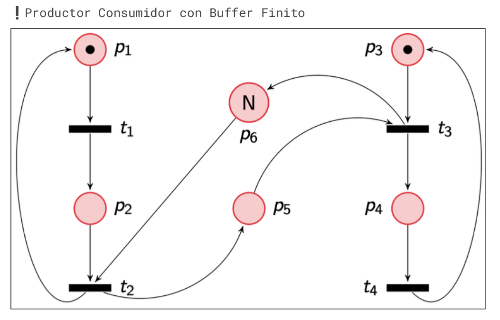
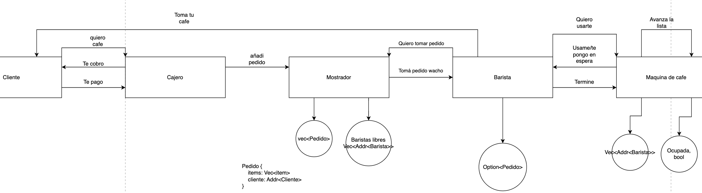

# 06/11/2024

https://www.notion.so/lihuencarranza/Parcial-2-24C2-154ec673880f80a6863eefb4981e7c6b

## Ejercicio 1, modelo de concurrencia

### A calcular producto de matrices para entrenar redes neuronales

Vectorización, se puede aplicar la misma operación para multiplicar las filas y columnas de manera paralela

### B realizar llamadas a diferentes APIs y combinar sus resultados

Async, ya que es la forma óptima de manejar diferentes conexiones externas concurrentes
sin bloquear el programa esperando a una sola respuesta a la vez

### C procesar logs

Suponiendo que se tienen uno o varios archivos muy largos de logs, se puede aplicar fork join sobre el o los archivos
y realizar el procesamiento correspondiente (tp individual)

### D backend app colaborativa

Estado mutable compartido que permita organizar el acceso al archivo por varios usuarios de manera concurrente

## Ejercicio 2

El código es un clásico productor consumidor con buffer de tamaño N.
El problema es que utiliza busy waits para verificar si se puede producir y consumir en vez de una herramienta de sincronización.
Esto causa que el programa sea más lento y menos eficiente ya que hace comprobaciones de más y no responde inmediatamente a los eventos
correspondientes.

solución: implementar productor consumidor con dos semáforos
sem1: cuenta los elementos producidos que se pueden consumir (arranca en 0)
sem2: cuenta el espacio disponible en el buffer para producir (arranca en N)

cuando se quiere consumir se debe hacer wait al sem1 y luego signal al sem2
cuando se quiere producir se debe hacer wait al sem2 y luego signal al sem1

el drop se utiliza para liberar el lock del buffer. Si no se hace esto mantendría el lock durante el sleep
bloqueando el recurso innecesariamente. Cabe aclarar que si no se pone el drop hay un drop implícito al salir del
scope de la iteración del loop.

## Ejercicio 3

## Ejercicio 4

### A

El estado interno de un actor solo puede ser accedido por el mismo actor, el cual procesa mensajes secuencialmente
que pueden utilizar su estado interno. El estado interno de un actor no puede ser accedido de manera paralela de
ninguna manera.

### B

FALSO FALSOSO FALSÓN. El poll se usa para hacer avanzar la parte sincronía y te devuelve el estado del future pero
nunca bloquea, esa es la principal característica de los futures.

### C

Se debe aplicar el modelo fork join utilizando operaciones que no dependan del orden de ejecución. Si se hace esto
correctamente no hay que preocuparse por condiciones de carrera

### D

Falso, las condvar pueden despertarse esporadicamente incluso si no se les envió una señal.

## Ejercicio 5

### actores, cafe

