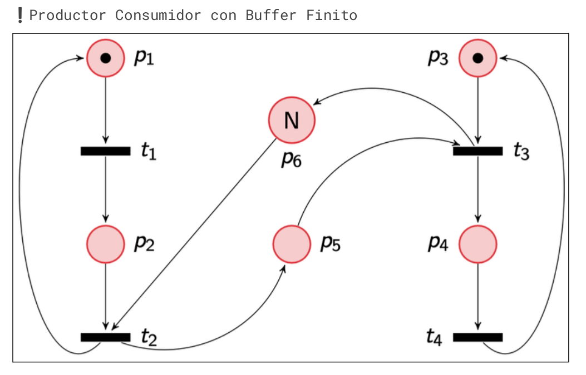

# 15/5/2024

(https://www.notion.so/lihuencarranza/Parcial-3-24C1-154ec673880f808dbae7ea2ec052468e)

## Ejercicio 1. Comparar estado mutable compartido y fork join. Cuando se usa cada uno y dar ejemplos.

Fork Join: Es un modelo de concurrencia que se recomienda en situaciones donde haya muchas tareas independientes entre si, y que se puedan dividir en sub tareas. Todo esto con el objetivo de poder realizarlas concurrentemente y al final unificar los resultados. Situaciones como el Trabajo Práctico Numero 1 de este cuatrimestre son ideales. Hay que leer registro por registro y analizarlo. Esto podía pasar con 1 o más archivos. En esta situación, el analisis registro por registro es independiente entre si, y al final podíamos unificar los resultados.

Estado Mutable Compartido: Es un modelo de concurrencia usado cuando tenemos algo que se deba compartir entre todos los threads. Este estado puede ser leido o editado por un thread a la vez, situación que se suele manejar con una herramienta de sincronización. Un ejemplo bueno es Google docs. Hay muchos usuarios adentro del mismo archivo, cada cambio se debe reflejar a todos los demas y los cambios que cada usuario hace no se deben pisar entre si.

## Ejercicio 2. Comparar Async con el modelo tradicional de threads del SO. Ventajas y desventajas. Ejemplos

Programación asincronica: Este modelo permite generar tareas más livianas que se van a ejecutar de forma asincrona. Se suele usar para comunicare concurrentemente con servicios externos (como APIs). Estas tareas pueden correr dentro del mismo proceso. Sin embargo, no es el mejor para las tareas de computo pesado, ya que los awaits traban la ejecución de las demás tareas asincronas.

Modelo Threads del SO: Permite paralelizar trabajo e forma independiente, generalmente de computo pesado. Sin embargo, crear los threads y cambiar de contexto son operaciones costosas y tardadas.

## Ejercicio 3. Encontrar error en el codigo.

La estructura es una barrera. Con el mutex contabilizamos cuantos threads llegaron a ese punto, y con size sabemos cuantos tienen que llegar.
El problema de esta implementacion esta en usar if para la condición. Esto podría generar un spurious wakeup mientras que usando While podemos evitarlo.

## Ejercicio 4. Encontrar errores y por que drop necesario.

El código es un clásico productor consumidor con buffer de tamaño N.
Sin embargo, al estar en loop preguntando si podemos producir o consumir, estamos gastando tiempo y recursos generando busy waits.

La solucion ante esto es usar dos semaforos. Uno para el productor, y otro para el consumidor.
El semaforo del productor arrancaría con N (puede generar N veces) y el del consumidor en 0 (no hay nada que consumir)
Cada vez que produzcamos hay que decrecer el valor del semaforo de produccion y aumentar el del consumidor. Caso contrario cuando consumamos.

el drop se utiliza para liberar el lock del buffer. Si no se hace esto mantendría el lock durante el sleep
bloqueando el recurso innecesariamente.

## Ejercicio 5. Red de petri del anterior

