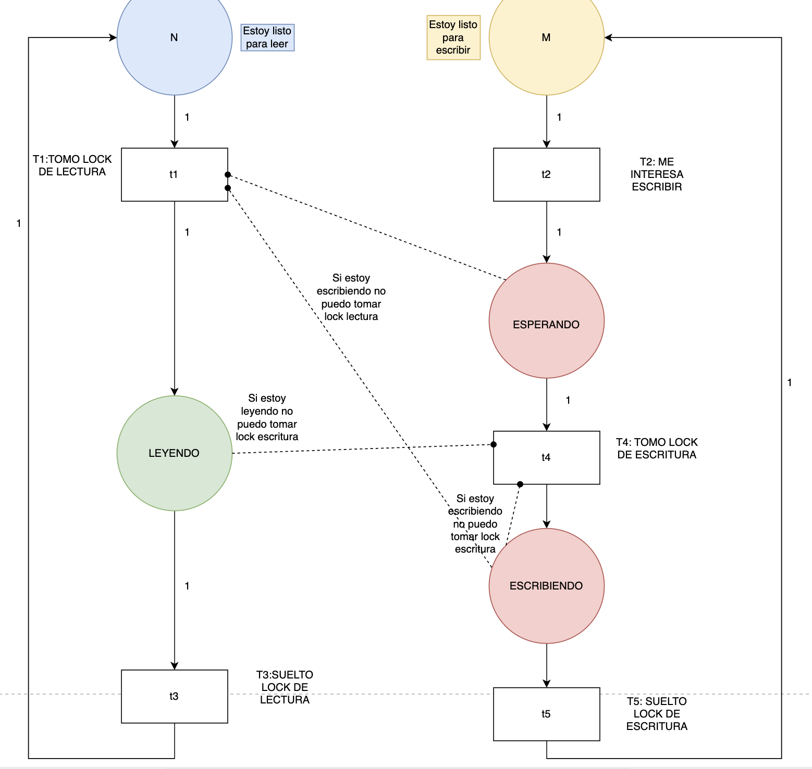

# FECHA DESCONOCIDA

https://www.notion.so/lihuencarranza/Parcial-3-24C2-159ec673880f80acafd3fabef41d8416

## Ejercicio 1, V o F

### A) fork join tiene race conditions

Para utilizar correctamente el modelo fork Join, se requiere de muchas tareas independientes que se puedan dividir en sub tareas para finalmente unificar los resultados. Si esto se cumple, no debería preocuparnos de tener una Race condition. Considerando esto, la respuesta es FALSO

### B) async se caracteriza por tareas de computo intensivo

Falso. En el modelo de programación asincronica, creamos tareas asincronas livianas que no sabemos cuando van a realizarse, para evitar la espera con tiempos muertos. Avanzamos con la parte sincrona y consultamos con Poll si ya tenemos el resultado de la función.

### C) el estado mutable compartido tiene que verficar el estado del hilo

Falso. Si bien el estado mutable compartido debe ser accedido por un hilo a la vez, son los hilos, con herramientas de sincronización, que verifican cuando pueden acceder al estado mutable compartido, y lo lockean para asegurarse de que nadie más entre mientras esten ellos.

## Ejercicio 2, modelo de concurrencia

### A) Un backend de un chat de amigos

Para esta situación elegiría la opción de usar estado mutable compartido. Cada mensaje tiene que mandarse de forma atomica y ser recibido por todos los demas.

### B) subir muchos archivos a la nube

Queremos subir muchos archivos a la nube, por lo que utilizaría fork Join. Subir cada archivo es independiente entre si, y nos permitiría paralelizar la tarea.

### C) server que reenvia requests a otros dispositivos

Queremos reenviar requests a otros dispositivos, pero no queremos trabar el trabajo esperando a reenviar cada uno. Por eso usaría programación asincronica, donde reenviar cada archivo sea una tarea asincrona.

## Ejercicio 3, hacer struct posible de escritor-lector favoreciendo al escritor. Explicar

```rust
struct LectorEscritor {
    pub lectores = i32 //lectores listos
    pub escribiendo = bool
    pub escritores = i32 //escritores listos
}

```

Con estos structs podríamos resolver el problema del lector escritor con prioridad al escritor. Habria que seguir las siguientes reglas.

- Un lector no puede leer hasta que escribiendo sea False y escritores sea 0 (o sea, le damos prioridad a que escriban todos los escritores que haya primero)

- Mientras el lector no pueda leer, debe estar considerado en lectores, y posterior a la lectura, ser descontado

- Un escritor puede escribir si escribiendo es false y si no hay nadie leyendo en ese momento.

- Si un escritor no puede escribir, se suma a escritores listos

## Ejercico 4. Red de petri de lo anterior



## Ejercicio 5. Con actores modelar: una oficina tiene personas que quieren imprimir documentos. No pueden usar la impresora al mismo tiempo. Diseñar mensajes con payload y toda la wea

me da que le falta mil detalles a esa descripción. Prefiero no hacerlo pero seguro tenga una estructura similar a los demas
